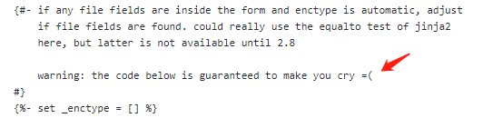

## Bootstrap4 定制验证(Custom Validation)  的简单实现方法

<small>
如果你只是想知道如何boostrap form validation, 请直接点
<a href="#main">正文</a>
和
<a href="https://getbootstrap.com/docs/4.1/components/forms/#validation">官方文档</a>
</small> 

### 0. 关于Flask技术栈渲染网页上的一些碎碎念 <small>a.k.a React定向安利</small>

通常遇到一些小的页面需求，我们会用bootstrap搞定。
不过，作为最基础的表单，用户输入的合法验证也是需要的。

过去，我通常的做法是用flask-wtf + flask-bootstrap，配合
quick_form宏在服务器端生成表单。到目前为止这依然是一个**可行**
的选项，而且依旧很方便，主要问题在于flask-bootstrap并不支持
bootstrap4, 同时wtf的文档太丑, 一旦需要进一步customize, 你就要
开始看源码, 然后去试jinja宏里提供的各种参数, 最后
fight against it。。真是惨痛回忆，想起来就头疼。。

下图是我看flask-bootstrap
[源码](https://github.com/mbr/flask-bootstrap/blob/master/flask_bootstrap/templates/bootstrap/utils.html)
时看到的@_@



于此同时，当下python技术栈的同志们的javascript水平也逐渐
开始6了起来，那么，直接撸前端是在正常不过的事情了。我因工作需求
搓了一个小React Native APP之后对React的技术栈就越发的喜爱起来,
先不管前端各个框架的布道师们是如何定义React, Angular, Vue的,
就我这种amateur而言React的JSX就是一个来自未来的, concise的界面描述引擎,
所有Jinja能干的事情都能干，而且能干的漂亮得多。平常，我每次写html+css都是很蛋疼的，有了JSX
我就可以All in JavaScript, python的灵活性和react的灵活性相近，
也让我有十足的亲近感。

### 1. Bootstrap Validation 的方法

首先, 表单的验证按官网分为"client side"和"server side",  
官网对"client side"的理解为通过游览器的Validation API去验证字段的合法性,
然后在form标签上加上"was-validated"来展示validation内容。

对于这种方法，一个简单的例子如下:
```html
<form> <!-- 请尝试更换为 <form class="was-validated">  -->
    <div class="form-group">
        <label>Name</label>
        <input type="text" class="form-control" required />
        <div class="invalid-feedback">这是一个invalid-feedback</div>
    </div>
</form>
```

本例子中给input元素加上了required属性, 因此游览器会主动地验证这个地方有没有填值。 
 
当form标签**没加**`was-validated`,那么就不会去触发`:invalid`和`:valid`这两个css伪元素,  
input外边框不会变成红色或者绿色, `.invalid-feedback`里的内容是隐藏的，如下:


然后如果游览器加上`was-validated`，因为`<input required>`，没填游览器就会主动触发:invalid, ，如下:


填了就是:valid, 如下:


如果你需要自己定义规则来触发:invalid和:valid元素, 那就需要很多
[html5+js API的知识](https://developer.mozilla.org/en-US/docs/Learn/HTML/Forms/Form_validation)了,
不过，与其在html5里的框架里跳舞，我还是想概念越少越好;)， 有兴趣的同学请点击上述链接扩展学习。

<div id="main"></div>
所以, 终于进入了本文的**主要内容**: `server-rendering`。

**长话短说**, 直接在`<input>`标签上挂`.is-invalid`和`.is-valid`, 不用在form上toggle`.was-validated`的class属性，就能显示
该input的验证状态, 并且控制其相邻`.invalid-feedback`元素的显示开关。

初始代码:
```html
<form>
  <div class="form-group">
    <label>Name</label>
    <input type="text" class="form-control" value="whatever"/>
    <div class="invalid-feedback">Server render invalid message</div>
  </div>
</form>
```

- `<input type="text" class="form-control" value="whatever" />` 不显示验证状态, 如下:  

- `<input type="text" class="form-control is-invalid" value="whatever" />` 显示invalid状态, 展示`.invalid-feedback`内容, 如下:  

- `<input type="text" class="form-control is-valid" value="whatever" />` 显示valid状态, 不展示`.invalid-feedback`内容, 如下:  


OK, Get了这个知识点，那么恭喜诸位Flask同学已经知道如何server-rendering了。

接下来介绍一下我用react实现的一个简单实现的Demo:
[Github Repo](https://github.com/aweffr/bootstrap-form-validate-example)
b
本例采用的是`controlled components`, 不了解的这个概念的请看[这里](https://www.reactjs.org/docs/forms.html)。
同时，由于bootstrap里的标准form做法是把input包在`.form-group`里, 这部分可以抽象成一个Dumb组件:
```jsx
import classNames from 'classnames';

function FormGroupText({label, name, type = 'text', onChange, placeholder, value, validation = {}}) {
  let id = `form-id-${name}`; // 用于label.for和input.id

  return (
    <div className="form-group">
      <label htmlFor={id}>{label}</label>
      <input
        id={id}
        type={type}
        className={classNames('form-control', {'is-invalid': validation.status === false}, {'is-valid': validation.status === true})}
        name={name}
        onChange={onChange}
        placeholder={placeholder}
        value={value}
      />
      {
        validation.msg &&
        <div className="invalid-feedback">
          {validation.msg}
        </div>
      }
    </div>
  );
}
```
上述代码中:
对函数参数语法不了解的同学可以看[这里](https://developer.mozilla.org/en-US/docs/Web/JavaScript/Reference/Operators/Destructuring_assignment#Default_values_2)
jsx中我推荐用classnames库来生成className代替手动拼接,[链接](https://github.com/JedWatson/classnames)

form表单的组件代码如下:
```jsx
import React, {Component} from 'react';

class App extends Component {

  state = {
    email: "", username: "", password: "",
    validation: {}
  };

  onInputChange = (e) => {
    const {name, value} = e.target;
    this.setState({[name]: value});
  };

  checkValidation = () => {
    let validation = {};

    if (this.state.email === "" || !this.state.email.endsWith('foxmail.com')) {
      validation.email = {status: false, msg: '钦定必须是foxmail邮箱!'};
      return [false, validation];
    } else {
      validation.email = {status: true};
    }

    if (this.state.username === "" || this.state.username.length < 5) {
      validation.username = {status: false, msg: '用户名字符必须大于5位'};
      return [false, validation];
    } else {
      validation.username = {status: true};
    }


    if (this.state.password === "" || this.state.password.length < 6) {
      validation.password = {status: false, msg: '密码必须大于6位 '};
      return [false, validation];
    } else {
      validation.password = {status: true};
    }

    return [true, validation]
  };

  onSubmit = (e) => {
    e.preventDefault(); // 阻止默认的提交的页面跳转行为
    e.stopPropagation();

    const [isValid, validation] = this.checkValidation();

    this.setState({validation});

    if (isValid) {
      // Do ajax jobs
    }
  };

  render() {
    const {validation} = this.state;
    return (
      <div className="container">
        <h2>Form Validation Demo</h2>
        {/* form 加上 noValidate 来阻止默认的浏览器的验证tooltips*/}
        <form
          method='post'
          onSubmit={this.onSubmit}
          noValidate
        >
          <FormGroupText
            label="Email"
            type="email"
            name="email"
            value={this.state.email}
            placeholder="aweffr@foxmail.com"
            onChange={this.onInputChange}
            validation={validation.email}
          />
          <FormGroupText
            label="User Name"
            type="text"
            name="username"
            value={this.state.username}
            placeholder="aweffr"
            onChange={this.onInputChange}
            validation={validation.username}
          />
          <FormGroupText
            label="Password"
            type="password"
            name="password"
            value={this.state.password}
            placeholder="Please Input Password"
            onChange={this.onInputChange}
            validation={validation.password}
          />

          <button type="submit" className="btn btn-block btn-primary">
            Submit
          </button>
        </form>
      </div>
    );
  }
}
```
上述demo的运行效果如下:


上述代码中:
- checkValidation方法为具体的验证字段的逻辑
    - 在实现上,我在每次验证一个字段后，如果invalid就直接return，是因为觉得这样对用户比较友好,这样用户不会一提交就满屏幕的红色:)
    - 每个`FormGroupText`组件中的status来自于表单的state.validation, 如email字段的属性位于`this.state.validation.email.status`
        - status: undefined => 未验证, `className='form-control'`
        - status: true => 合法, `className='form-control is-valid'`
        - status: false => 不合法, `className='form-control is-invalid'`
    - onInputChange中`{[name]: value}`这个语法请参考[这里](https://developer.mozilla.org/en-US/docs/Web/JavaScript/Reference/Operators/Object_initializer#New_notations_in_ECMAScript_2015)  
    Ctrl + F5 `Computed property names (ES2015)`
    


### More
当然, 这个例子里的validation实现方法还是很粗糙的。更进一步，严肃的项目上我们会去验证某个字段是不是必须是数字，是不是只能含有中文，是不是不能包含特殊字符，以及输入长度验证和密码强度验证。
这就要求把validation rules配置化。这方面我用过的，体验非常好的是大哥级组件库`antd`。有兴趣的同学可以去[antd表单](https://ant.design/components/form-cn/)  
和它的具体实现[rc-forms](http://react-component.github.io/form/examples/redux.html)做进一步学习,  
他们把验证的部分解耦到了[async-validator](https://github.com/yiminghe/async-validator)上，用起来挺顺手的,
尤其他们开发时划分表单problem的方法和思路尤其值得学习。

不过，至于如何上手antd，以及其官方大佬所实现的脚手架[umijs](https://umijs.org/)，乃至react状态管理摊开来讲就又是一篇博客了。To Be Continued.

